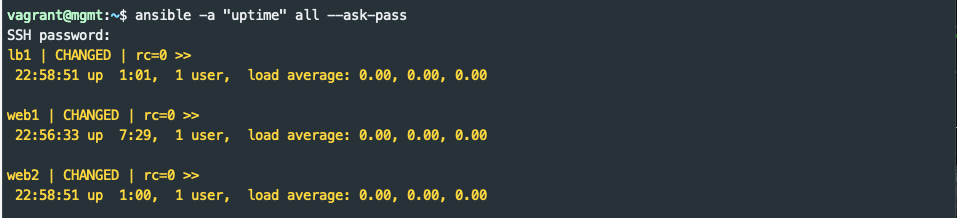
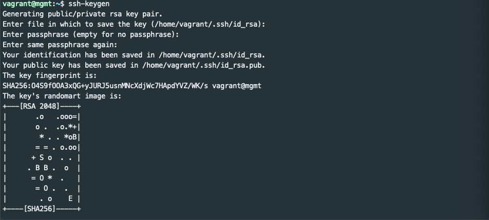

# SSH Keys
In the previous session, it was necessary to first SSH to the target node, accept its fingerprint, and interactively enter a password before executing the first Ansible command.  This is OK for one or two nodes but would be painful when scaling to tens, hundreds, or thousands of nodes.  SSH provides the ssh-keyscan tool and key based authentication to solve these issues.

# ssh-keyscan
[ssh-keyscan](https://man.openbsd.org/ssh-keyscan) is a utility for gathering the public SSH host keys of a number of hosts.  It can be used to append entries for each of the lab hosts to the management node's `~/.ssh/known_hosts` file as follows:

```bash
$ ssh-keyscan lb1 web1 web2 >> ~/.ssh/known_hosts
```

`ssh-keyscan` will print a couple lines of output for each node that it scans.  It also adds entries to the known_hosts file.  If you are curious, you can run `cat ~/.ssh/known_hosts` to see the current contents.

Now try to execute another ad hoc command to test the host keys for each node in the lab:

```bash
$ ansible -a "uptime" all --ask-pass
```
You'll see the following:


Ansible connected to each node via SSH without requiring manually accepting each node's host key.  It then ran the uptime command on each node to show load averages.

# Key based authentication
SSH can provide password-less logins by using a public/private key pair.  The details of key based authentication are outside the scope of this tutorial, but the steps below can be followed to setup basic key based auth.

## Generate an SSH key pair
The [ssh-keygen](https://man.openbsd.org/ssh-keygen) command can generate a key pair used for SSH authentication.  Your own computer may already have a key pair, but the lab `mgmt` node needs one created as follows:

```bash
$ ssh-keygen
```

Accept the default location for the key.  It isn't best practice to have an empty passphrase, but leave it empty for this lab.  After hitting enter a couple times you should see that a key pair is created followed by an ascii art representation of it like this:



# ssh-copy-id

You are ready to copy your key to the server.  The `ssh-copy-id` utility makes this easy.

```bash
$ ssh-copy-id vagrant@web1
```

Enter the vagrant user's password (`vagrant`) when prompted.

When the key copy is complete it will suggest you try logging in again as follows: `ssh 'vagrant@web1'`.  This should connect you to a `vagrant@web1:~$` prompt without having to type in a password.  Use the `exit` command to return to the `mgmt` node.

[This](https://www.ssh.com/ssh/copy-id) is a nice overview of ssh-copy-id and password-less logins.

## Hello Ansible (Again!)

Now that password-less login is setup on `web1` it is time to try another "Hello World":

```bash
$ ansible -a "echo 'Hello Ansible (Again)'" web1
```

Notice that `--ask-pass` was not needed.

# Next: Automating Key Distribution
Using `ssh-copy-id` for every node in a large environment is a lot of manual work just to get an automation tool working.  Fortunately, Ansible has a module to manage ssh keys.  The first section of [Lab 1](../lab-1/lab-1.md) explains how to use Ansible's `authorized_key` module.

[Continue to Lab 1](../lab-1/lab-1.md)