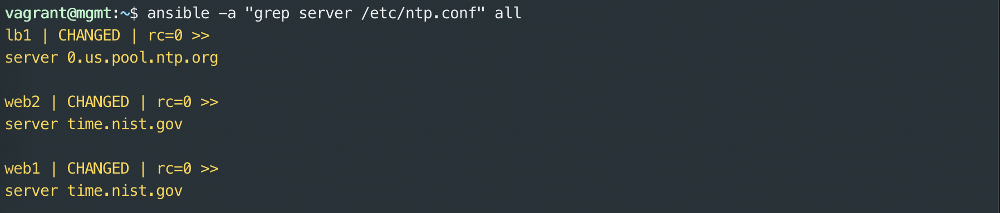

# authorized_keys
In a [previous section](../keys/keys.md#ssh-copy-id) you manually copied an SSH key to a managed node.  This does not scale well to hundreds of nodes.  The following section gives an early peek at using an Ansible playbook that uses the [authorized_keys](https://docs.ansible.com/ansible/latest/modules/authorized_key_module.html) module to distribute your ssh key to all of the lab nodes.

## Authorized Keys Playbook
Ansible playbooks are [YAML](https://en.wikipedia.org/wiki/YAML) files that contain Ansible configuration and instructions.  YAML is relatively easy to read, but sometimes difficult to write.  YAML isn't covered in depth here, but the examples should be easy to reproduce.

_It is important to note that spacing is critical in YAML.  If you are getting errors, check the spacing in your playbooks._
```yaml
---
- hosts: all
  become: yes
  gather_facts: no
  remote_user: vagrant

  tasks:

  - name: install ssh key
    authorized_key:
      user: vagrant
      key: "{{ lookup('file', '/home/vagrant/.ssh/id_rsa.pub') }}"
      state: present
```

Don't worry about all the details right now.  In summary, there is one task that runs the [authorized_keys](https://docs.ansible.com/ansible/latest/modules/authorized_key_module.html) module and ensures that the key is present on all nodes in the inventory.

The `ansible-playbook` command is used to execute playbooks.  _Note this is different than the `ansible` command that is used for ad hoc executions._

Run the playbook 1-1-ssh-addkey.yml as follows to distribute
the key.

```bash
$ ansible-playbook 1-1-ssh-addkey.yml --ask-pass
```

The output will look something like this:


# Idempotent

**If I'm going to be Idempotent, I want to look Idempotent**

Good Ansible modules aim to be [Idempotent](https://en.wikipedia.org/wiki/Idempotence).  This means the module can be run again and again with the same input without changing the outcome.  In this case, if we run the same playbook again the recap should indicate that none of the nodes changed.


Take note that `--ask-pass` is no longer needed on subsequent executions of `ansible-playbook`.

# Ping

Ansible provides a [ping](https://docs.ansible.com/ansible/latest/modules/ping_module.html) module to help verify hosts are setup correctly.

Run the ping module as follows:

```bash
$ ansible -m ping all
```

Among the output you should see a `"ping": "pong"` response for each node in the inventory.  This tool is not like the network tool of the same name.  It does not check ICMP connectivity, but rather verifies ability to login and a usable environment is available on the managed node.

Experiment with the following ping commands to see if you can guess how the groups in `inventory.ini` are used:

```bash
$ ansible -m ping lb
$ ansible -m ping web
$ ansible -m ping all
$ ansible -m ping web1
```

# Package, File, Service

Those familiar with Puppet, Chef, SaltStack, or other similar tools have probably seen the Package, File, Service pattern.  A common scenario would be install HTTPD package, update its config file, and start the service on a new web server.  Ansible provides multiple ways to accomplish these goals.  We'll first look at ad hoc commands, then playbooks, and maybe roles.

## Warning!  Don't do this (unless you must)

Ubuntu Linux uses the `apt` package manager to install and update packages.  A sysadmin could use a couple ad hoc Ansible invocations that uses the `command` module like this to install the NTP package on `web1`:

```bash
# DON'T DO THIS
$ ansible -a "sudo apt-get update" web1
$ ansible -a "sudo apt-get install ntp" web1
```

This is better than logging into each vm and manually running the commands.  You'll probably get several warning messages from Ansible not to use sudo and not to call apt-get directly.  Ansible provides modules to do it a better way.

## Better: Ad Hoc pkg Module

Ansible provides the [apt](https://docs.ansible.com/ansible/latest/modules/apt_module.html) to manage packages on Linux distributions like Debian and Ubuntu.  The [yum](https://docs.ansible.com/ansible/latest/modules/yum_module.html) and more generic [package](https://docs.ansible.com/ansible/latest/modules/package_module.html) modules are also available for Red Hat and other Linux environments.

Try this to install and start the NTP service on `web1`

```bash
$ ansible -m apt -a "package=ntp state=present" --become web1
# Then try it a second or third time... does it change anything?
$ ansible -m apt -a "package=ntp state=present" --become web1
# Start NTP using the service module
$ ansible -m service -a "name=ntp state=started" --become web1
```

You may have noticed the commands above had a new argument `--become`.  Without diving into details, it means use escalated privileges to execute the modules.  In this case it is similar to using `sudo` to use root privileges.  More details [here](https://docs.ansible.com/ansible/latest/user_guide/become.html)

## More Better: Playbooks

Ansible playbooks are a collection of tasks to be executed in sequence.  Playbooks are written [YAML](https://en.wikipedia.org/wiki/YAML) and are easy to read.  At the start of each play you'll usually see:

* `hosts:` - which hosts (or groups) to target
* `become:` - whether or not privilege escalation is needed
* `gather_facts` - whether or not to collect information about the managed node

Playbooks include a list of tasks.  Tasks should start with a descriptive name followed by the module and its arguments.

A playbook consisting of three tasks (and a handler) to install and configure NTP is below:

```yaml
---
- hosts: all
  become: yes
  gather_facts: no

  tasks:

  - name: install ntp
    apt:
      name: ntp
      state: present
      update_cache: yes

  - name: write our ntp.conf
    copy:
      src: /home/vagrant/files/ntp.conf
      dest: /etc/ntp.conf
      mode: 0644
      owner: root
      group: root
    notify: restart ntp

  - name: start ntp
    service:
      name: ntp
      state: started

  handlers:

  - name: restart ntp
    service:
      name: ntp
      state: restarted
```

A couple new concepts are introduced in this playbook.  The [copy](https://docs.ansible.com/ansible/latest/modules/copy_module.html) module is used to upload and configure the `ntp.conf`.  The [handlers](https://docs.ansible.com/ansible/latest/user_guide/playbooks_intro.html#handlers-running-operations-on-change) section will kick off tasks that are only necessary when something changed.  In this case, when ntp.conf is changed it does a `notify` on the restart handler to restart the NTP service.

Run the playbook as follows:

```bash
ansible-playbook 1-2-ntp-install.yml
```

On the very first run it will install the package, write the config, and start (or restart) ntp.
Then run it again:

```bash
ansible-playbook 1-2-ntp-install.yml
```

On subsequent executions, it should not change anything or restart the service.  This is an example of an `idempotent` playbook.  This is a more desirable pattern than ad hoc commands.

Review the following playbook and guess what it will do:

```yaml
---
- hosts: all
  become: yes
  gather_facts: no

  tasks:

  - name: remove ntp
    apt:
      name: ntp
      state: absent
```
If you need a hint, review the docs for the [apt](https://docs.ansible.com/ansible/latest/modules/apt_module.html) module.

Now run the playbook above like this:

```bash
$ ansible-playbook 1-3-ntp-remove.yml
```

# Variables and Templates

Using playbooks like we have so far makes it easy to perform tasks quickly and repeatably.  Ansible is even more powerful when you begin to use variables and templates.

With variables and templates, you can use the same playbooks and roles across different environments and substitute specific values on per-environment basis.  For example, you could configure DNS settings in /etc/resolv.conf for servers in production, disaster recovery, and development datacenters with the same playbook, but substitute the appropriate IP addresses of the DNS servers for each location.

## NTP Config Template Example

A good way to get familiar with variables and templates is to walk through an example.  In this (somewhat contrived) example, we have decided that the NTP service on the web servers need to use a specific time server while the load balancer must use a different one.  This might be the case when the webservers are in a firewalled segment that doesn't permit access to the internet.

Our example template file for the NTP playbook is in `templates/ntp.conf.j2`.  The `.j2` extension indicates it is a [Jinja 2](https://en.wikipedia.org/wiki/Jinja_(template_engine)) template.  Jinja is a template engine used by Ansible (and other Python applications).  It is a whole language on its own.  Today we'll only use it for variable substitution.  It may be helpful to think of Ansible templating is like using the mail merge function of an office suite.  It takes values from a database and merges them into a templated file.

Only one variable is in `templates/ntp.conf.j2`:

```bash
# ...lines above
filegen clockstats file clockstats type day enable
server {{ ntp_server }}
restrict -4 default kod notrap nomodify nopeer noquery
# ... lines below
```

This template contains typical `ntp.conf` values and looks very similar to the file that was used by the `copy` module in the earlier playbook except the line `server {{ ntp_server }}`.  The template module will replace the section with double curly braces (or mustaches) with a variable.

Variables can be defined in several different locations including the inventory, playbooks, or "vars" files.  In our example, we will use the `group_vars` directory to define a different value of the variable to be used for each inventory group.  The `group_vars` directory contains a file for each group (and optionally a file for the special `all` group).  Ansible determines the values for variables in templates before deploying the rendered files to the servers.

The group_vars directory looks like this:
```bash
group_vars
├── lb
└── web
```

The lb and web files each contains a key/value pair for the `{{ ntp_server }}` variable.  group_vars files can contain multiple variables.  Variable can also be YAML dictionaries.  See the [Using Variables](https://docs.ansible.com/ansible/latest/user_guide/playbooks_variables.html) documentation for many more examples.


Now, run the updated playbook to use the template:

```bash
$ ansible-playbook 1-4-ntp-template.yml
```

Try the following ad hoc ansible command to use the `command` module and `grep` to inspect the server line /etc/ntp.conf on each server in the inventory:

```bash
ansible -a "grep server /etc/ntp.conf" all
```

We used the same playbook and the template module to configure environment specific config files.



The [next lab](../lab-2/lab-2.md) covers using playbooks to configure a semi-realist scenario of multiple applications on multiple servers.
