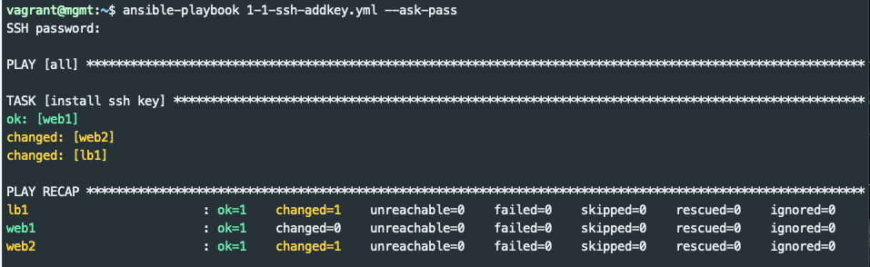
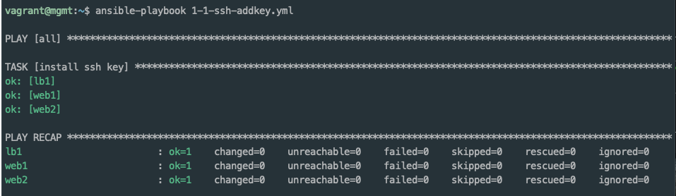

# authorized_keys
In a [previous section](../keys/keys.md#ssh-copy-id) you manually copied an SSH key to a managed node.  This does not scale well to hundreds of nodes.  The section gives an early peek at using an Ansible playbook that uses the [authorized_keys](https://docs.ansible.com/ansible/latest/modules/authorized_key_module.html) module to distribute your ssh key to all of the lab nodes.

## Authorized Keys Playbook
Ansible playbooks are [YAML](https://en.wikipedia.org/wiki/YAML) files that contain Ansible configuration and instructions.  YAML is relatively easy to read, but sometimes difficult to write.  YAML isn't covered in depth here, but the examples should be easy to reproduce.

_It is important to note that spacing is critical in YAML.  If you are getting error, check the spacing in your playbooks._
```yaml
---
- hosts: all
  become: yes
  gather_facts: no
  remote_user: vagrant

  tasks:

  - name: install ssh key
    authorized_key:
      user: vagrant
      key: "{{ lookup('file', '/home/vagrant/.ssh/id_rsa.pub') }}"
      state: present
```

Don't worry about all the details right now.  In summary, there is one task that runs the [authorized_keys](https://docs.ansible.com/ansible/latest/modules/authorized_key_module.html) module and ensures that the key is present on all nodes in the inventory.

The `ansible-playbook` command is used to execute playbooks.  _Note this is different than the `ansible` command that is used for ad hoc executions._

Run the playbook 1-1-ssh-addkey.yml as follows to distribute
the key.

```bash
$ ansible-playbook 1-1-ssh-addkey.yml --ask-pass
```

The output will look something like this:



# Idempotent

**If I'm going to be Idempotent, I want to look Idempotent**

Good Ansible modules aim to be [Idempotent](https://en.wikipedia.org/wiki/Idempotence).  This means the module can be run again and again with the same input without changing the outcome.  In this case, if we run the same playbook again the recap should indicate that none of the nodes changed.



Take note that `--ask-pass` is no longer needed on subsequent executions of `ansible-playbook`.

# Ping

Ansible provides a [ping](https://docs.ansible.com/ansible/latest/modules/ping_module.html) module to help verify hosts are setup correctly.

Run the ping module as follows:

```bash
$ ansible -m ping all
```

Among the output you should see a `"ping": "pong"` response for each node in the inventory.  This tool is not like the network tool of the same name.  It does not check ICMP connectivity, but rather verifies ability to login and a usable environment is availble on the managed node.

Experiment with the following ping commands to see if you can guess how the groups in `inventory.ini` are used:

```bash
$ ansible -m ping lb
$ ansible -m ping web
$ ansible -m ping all
$ ansible -m ping web1
```