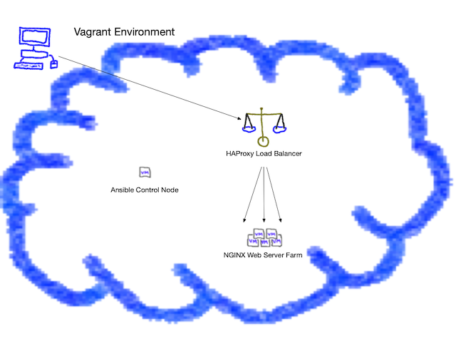
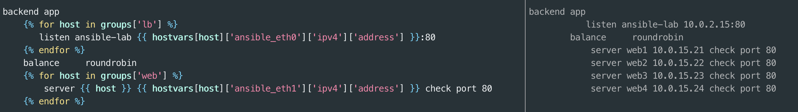
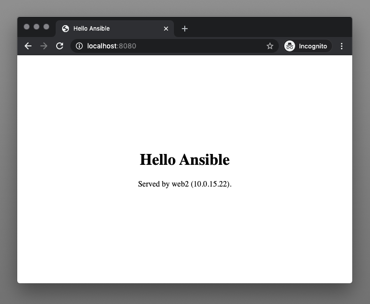
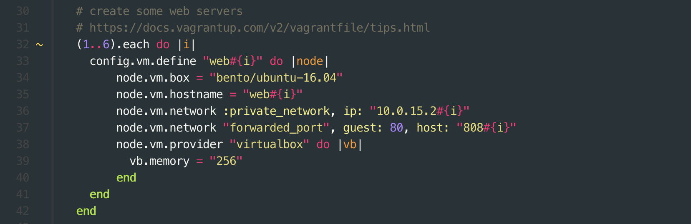

# Load Balancer and 2 (or more) Web Servers

The end result of this lab will be an automatically deployed and configured HAProxy load balancer with a group of web servers.
[](../img/labDrawing.png)

# Playbook with multiple plays
Review the contents of `2-1-site.yml`.  It contains multiple plays that use modules that have already been covered and also introduces a couple new ones.


## Common
The first play targets all nodes in the inventory.  It uses the `apt` module to ensure the git package is installed on all nodes.  These settings are common to all managed nodes.

## Web
The next play targets only members of the web group in the inventory.  It uses the `apt` module to install the NGINX webserver, `template` to create the NGINX config file and page content.  If needed, it will use a handler to restart NGINX.

## Load balancer
The final play targets only the load balancer group.  This play employs some new tricks:

* The [apt](https://docs.ansible.com/ansible/latest/modules/apt_module.html) module now uses [with_items](https://docs.ansible.com/ansible/latest/user_guide/playbooks_loops.html#with-items).  You can think of `with_items` as looping over the list and running the `apt` module for each item in the list.  It uses the variable syntax to substitute each package name.

```yaml
  - name: install haproxy and socat
    apt:
      name: "{{ item }}"
      state: present
    with_items:
    - haproxy
    - socat
```

* The next play uses the [lineinfile](https://docs.ansible.com/ansible/latest/modules/lineinfile_module.html) module.  `lineinfile` ensures a particular line is in a file, or replace an existing line using a regular expression.  This is primarily useful when you only want to change a single line in a file.  The logic here is "find a line that starts with ENABLED" and replace it with "ENABLED=1".  _The `template` module is preferable in cases where control of the contents of the entire file is important._

```yaml
  - name: enable haproxy
    lineinfile:
      dest: /etc/default/haproxy
      regexp: "^ENABLED"
      line: "ENABLED=1"
    notify: restart haproxy
```

The templates directory contains .j2 (Jinja2) files that are merged before playbook execution.  The templates are mostly stock configuration files plus ansible variables and a little bit of Ansible magic.

The `template/default-site.j2` template is used to create the NGINX site configuration.  It begins by inserting a comment that the file is managed by Ansible with the `{{ ansible_managed }}` variable.  You can customize this message to warn sysadmins that changes made by hand will be overwritten by the next Ansible run.

The NGINX configuration should include the server's hostname.  Rather than hardcoding the hostname in the template, the Ansible Fact `{{ ansible_hostname }}` dynamically inserts the hostname on a per-host basis.  This is a good pattern for making playbooks reusable.

```bash
# {{ ansible_managed }}
server {

        listen 80;
        server_name {{ ansible_hostname }};
        root /usr/share/nginx/html;
        index index.html index.htm;

        location / {
                try_files $uri $uri/ =404;
        }

        error_page 404 /404.html;
        error_page 500 502 503 504 /50x.html;
        location = /50x.html {
                root /usr/share/nginx/html;
        }

}
```

The other templates have employ similar methods of variable and fact substitution. A more advanced use of templating occurs in the `haproxy.cfg.j2` template.  The `backend app` section of the configuration uses Jinja loops and Ansible facts to render the config.  This will later allow adding new hosts to the `web` group with no need to change the template.

**Jinja loops are an advanced template topic for future learning.  See below for an example of the template and rendered config file side by side.**


[](../img/haproxyConfig.png)

# Play Time...

Run the playbook to configure the environment.

```bash
$ ansible-playbook 2-1-site.yml
```

If all goes well, your play recap will indicate success.

If you run the playbook a second time, the recap should indicate no changes.

Behind the scenes, Vagrant has forwarded a port to the HAProxy virtual machine.  Test it out by browsing to `http://localhost:8080`.  Refresh the browser several times to see if traffic is being served from both servers.



# Experiment

Now try to increase the number of web servers.  Exit from the `mgmt` virtual machine and edit the Vagrantfile on your local machine to 6 servers (or 3 or 4 if your computer is low on memory, but not more than 9). Change the 2 in `(1..2).each do |i|` to 6 like the example.  The Vagrantfile syntax isn't related to Ansible and doesn't need to be understood.




Launch the new VM's and log into the `mgmt` node:

```bash
$ vagrant up
$ vagrant ssh mgmt
```

After the new servers are booted, you'll need to update the inventory to include them (in this case remove the #'s from each relevant line in inventory.ini).  Also you'll need to make sure password-less logins are working.  The [Keys](../keys/keys.md) lab can guide you if you need help.

* Run the playbook again.  Refresh the browser.  Does it change?

* Experiment with using templates to deploy changes to the contents of the web page.

* Try ad hoc commands to stop the service on one or two nodes.  What happens when you refresh the web page?

* What does `ansible -a "cat /etc/haproxy/haproxy.cfg" lb1` do?


[Lab 3](../lab-3/lab-3.md) will discuss breaking down larger playbooks into more modular roles.

