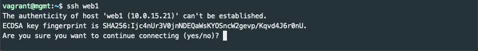
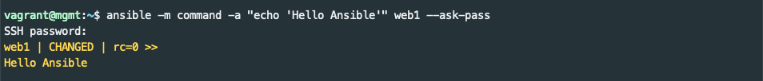

# Overview
The intent of this lab is to provide a gentle introduction to Ansible and provide an environment for further learning and experimentation.  Not all Ansible features are covered, but basics such as ad hoc command execution, playbooks, and templates are introduced.

# Lab Software (Prerequisites)
The lab environment consists of Ubuntu virtual machines powered by VirtualBox and managed by Vagrant.  Neither VirtualBox or Vagrant are covered in depth.  They are used as part of the lab, but full understanding isn't required.

Each of the following should be installed prior to the lab.  Setup of prerequisites will take around 20 minutes:

* Git and SSH are used for downloading example code and connecting to virtual machines.  Many Linux distributions and macOS provide these tools out of the box.  The [Windows Subsystem for Linux](https://docs.microsoft.com/en-us/windows/wsl/install-win10) and [Git for Windows](https://gitforwindows.org/) are both good options to use Git and SSH in Windows.  Git for Windows is recommended.

* [VirtualBox](https://www.virtualbox.org/wiki/Downloads) is an open source virtualization product.  It runs on Windows, Linux, and Mac and supports most common guest operating systems.  **You may need to run the installer as administrator to avoid an installation error.**

* [Vagrant](https://www.vagrantup.com/downloads.html) is a tool for building and managing virtual machine environments.  A `Vagrantfile` provides a configuration that builds and provisions the multiple VM's in this lab.

    * Understanding of Vagrant isn't necessary, but being familiar with a few basic commands is helpful:
        * `vagrant up`: starts and provisions the Vagrant environment
        * `vagrant ssh <hostname>`: connect to virtual machine with SSH
        * `vagrant halt`: stops virtual machine(s)
        * `vagrant destroy`: terminate and destroy virtual machines
        * `varant help`: get Vagrant help

# Getting Started:
Open shell and change to an appropriate directory.  Clone the git repository and cd into it:
```bash
$ cd ~/Downloads
$ git clone <PLACEHOLDER>
$ cd ansible-lab
```
Use your favorite text editor, less, or more to inspect the `Vagrantfile` and `bootstrap-mgmt.sh` files.  The Vagrantfile (initially) defines four virtual machines.  `web1` and `web2` will be configured as web servers.  `lb1` will be configured as an [HAProxy](http://www.haproxy.org/) software load balancer to distribute traffic to each webserver.  A [control node](https://docs.ansible.com/ansible/latest/user_guide/basic_concepts.html#control-node) called `mgmt` will be configured (or bootstrapped) by Vagrant to automatically preinstall Ansible, copy lab examples, and populate its /etc/hosts file.

It it not necessary to understand the Vagrant files in order to do the Ansible lab.

# Start the Virtual Machines
From the ansible-lab directory, use Vagrant to start the four virtual machines.
```bash
$ vagrant up
```

The `vagrant up` command will take several minutes (even on a fast internet connection) as it downloads virtual machines, boots them, and configures the virtual environment.

Now is a good time to take a break.

Connect to the `mgmt` server like this:
```bash
$ vagrant ssh mgmt
```


# Hello Ansible!
If all went well, you should be at a shell prompt inside the mgmt virtual machine that looks like `vagrant@mgmt:~$`.

Once ssh'ed into the `mgmt` node. Verify that Ansible has been automatically been installed.

```bash
$ ansible --version
```

Since Ansible will be using SSH to connect to our managed nodes, make sure you can SSH to `web1`.

```bash
$ ssh web1
```

You should receive a warning similar to the following:



If you know SSH, you'll recognize that the SSH client doesn't recognize the fingerprint of the SSH server.  Since it is the first time connecting to this node it is to be expected.  Answer `yes` to add web1 to the list of known hosts.

**The default password for the vagrant user on the lab machines is `vagrant`.**

Enter the password and you should be at a `vagrant@web1:~$` prompt inside the `web1` virtual machine.  Use the `exit` command to return to the `mgmt` machine.


Now that you can SSH to web1 you are ready for the first Ansible command.  As tradition dictates, our first command will print `Hello Ansible`. You will be asked for the SSH password after you run the following:

```bash
$ ansible -a "echo 'Hello Ansible'" web1 --ask-pass
```

This is an ad hoc Ansible execution that targets the `web1` node and implicitly uses the `command` module to execute `echo 'Hello Ansible`.  `--ask-pass` (which is abbreviated `-k`) tells Ansible you want to provide a password interactively.  If it works, you'll see:



Manually accepting host keys and typing passwords interactively is no fun.  You'll see in the next session how to make it less painful.

# More resources
The Ansible documentation has a nice introduction to ad hoc commands [here](https://docs.ansible.com/ansible/2.5/user_guide/intro_adhoc.html).